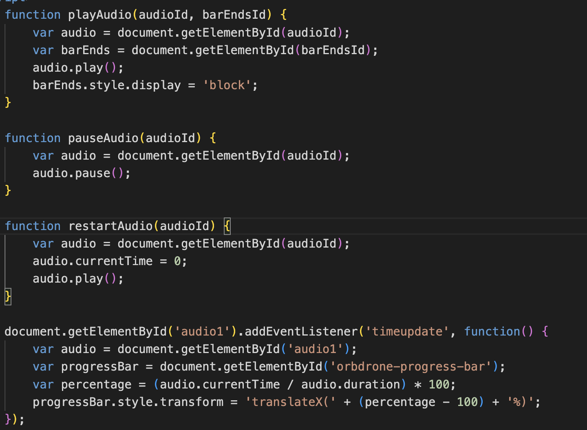

# Welcome to my website!

The homepage is `my_website.html`.

- For the final, I decided to build out the missing pages and add a bit to the FAQs section to start out what I intend to be a long trail of various random pages.
- I added the portfolio pages, trying to be creative in how I presented the work, such as the 3D thumbnails which I printed then scanned, or the playback buttons I made from scratch.

- This is the code I wrote for the playback buttons. It was quite challenging, but not as bad as I thought it would be. Honestly, I found positioning to be more frustrating. But by far, the hardest thing was trying to make a second instance of the buttons not interfering with the first one. I think I'll have to clean up my approach in order to expand this to where I want it.

- A very persistent problem I've been having is with cursors. I am rarely able to assign the cursor I want; usually, when I assign a custom cursor or even just a pointer to a specific area, it'll only briefly flicker to the cursor I want. Occasionally, it'll work perfectly for a few hours and then go back to being broken, and I have no idea why.
- Another issue I've had is that the entire website slowed down dramatically out of nowhere, and I have no idea what caused this.

- Expanding this website taught me a lot of things, such as making multiple instances of an interface element such as modals or playback buttons. It was interesting to learn about audio manipulation in JavaScript, which already had very useful functions. Working on the modals also taught me a lot. It was challenging, but in the end, I was able to achieve almost exactly what I intended.

- I intend to keep working on this website. I want to fix some of the bugs such as the broken cursors and the slowness. I also need to include more portfolio items. A challenging part of this project was actually choosing which of my works to put on the portfolio pages. I ended up putting only a few things, so I need to decide what to add. As for the FAQs, I intend to keep building it out to include random sketches, writing, and GIFs that I've made.
